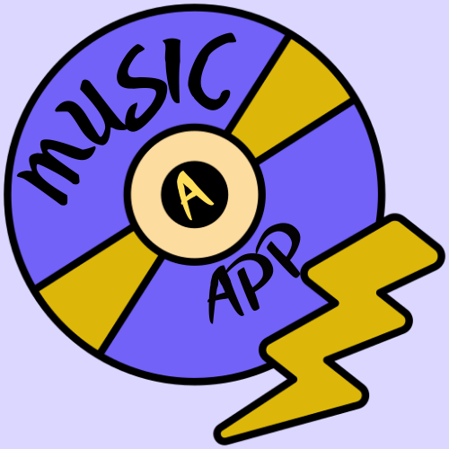

<p align="center">
	
</p>

# A Music App

<p align="center">A Flutter music player app.</p>

<p align="center">
	
	
	
</p>

---

## Features

- Play local audio files with a sleek UI
- Search and browse your music library
- Customizable themes (Light & Dark mode)
- Full playback controls (play, pause, skip, seek)

<!-- ## 📸 Screenshots

<div align="center">
	
	
</div> -->

## Getting Started

1. **Clone the repo:**
	 ```sh
	 git clone https://github.com/swayam0815/music_player.git
	 cd music_player
	 ```
2. **Install dependencies:**
	 ```sh
	 flutter pub get
	 ```
3. **Run the app:**
	 ```sh
	 flutter run
	 ```

## 🛠️ Tech Stack

- [Flutter](https://flutter.dev/) 3.9+
- [just_audio](https://pub.dev/packages/just_audio)
- [on_audio_query](https://pub.dev/packages/on_audio_query)
- [provider](https://pub.dev/packages/provider)


## Credits

- [Flutter](https://flutter.dev/)
- [just_audio](https://pub.dev/packages/just_audio)
- [on_audio_query](https://pub.dev/packages/on_audio_query)
- [Mitch Koko](https://youtu.be/Zr4j6W7nmpg?si=aWVDRoAYG19sxoyI) (for the UI skeleton tutorial)

## 📄 License

This project is licensed under the MIT License.

---

<div align="center">
	<sub>Made with ⚡ using Flutter</sub>
</div>
